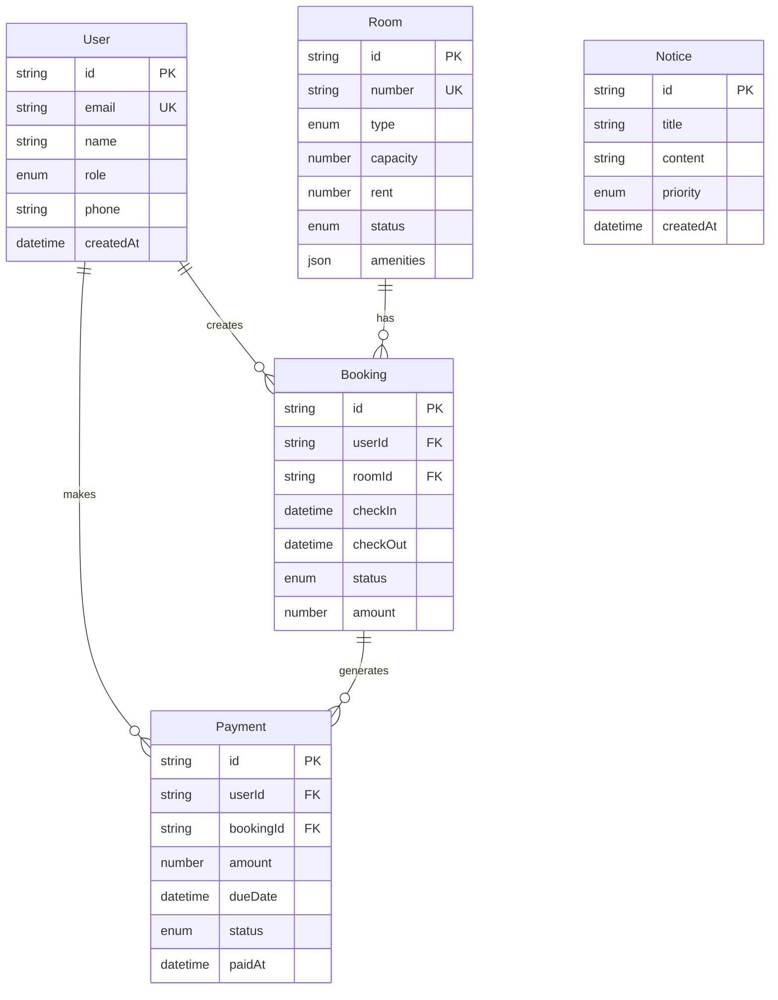

# 🏠 InMate - Complete Hostel Management System

<div align="center">


**A modern, full-stack hostel management solution built with Next.js 15**

🚀 **[LIVE DEMO - Try InMate Now!](https://in-mate-qksz9o6y1-md-mustaks-projects-4435f18d.vercel.app)** 🚀

[](https://in-mate-qksz9o6y1-md-mustaks-projects-4435f18d.vercel.app)
[](https://github.com/mustaque01/InMate)
[](./LICENSE)

</div>

## 📸 Screenshots

<table>
<tr>
<td align="center"><strong>🏠 Landing Page</strong></td>
<td align="center"><strong>🔐 Login System</strong></td>
</tr>
<tr>
<td></td>
<td></td>
</tr>
<tr>
<td align="center"><strong>👨‍💼 Admin Dashboard</strong></td>
<td align="center"><strong>👨‍🎓 Student Portal</strong></td>
</tr>
<tr>
<td></td>
<td></td>
</tr>
</table>

## 🎮 Live Demo

🔗 **Experience InMate:** [https://in-mate-qksz9o6y1-md-mustaks-projects-4435f18d.vercel.app](https://in-mate-qksz9o6y1-md-mustaks-projects-4435f18d.vercel.app)

### 🔑 **Test Accounts**

<table>
<tr>
<th>Role</th>
<th>Email</th>
<th>Password</th>
<th>Access</th>
</tr>
<tr>
<td>👨‍💼 <strong>Admin</strong></td>
<td><code>admin@hostel.com</code></td>
<td><code>admin123</code></td>
<td>Full management dashboard</td>
</tr>
<tr>
<td>👨‍🎓 <strong>Student</strong></td>
<td><code>john.doe@student.com</code></td>
<td><code>student123</code></td>
<td>Student portal and booking</td>
</tr>
</table>

## 🎯 Overview

**InMate** is a comprehensive hostel management system designed to streamline operations for educational institutions and hostels. It provides separate dashboards for administrators and students with complete room booking, payment tracking, and notice management functionality.

### 🔥 **Try Live Demo Now!**
**🌐 Production App:** [https://in-mate-qksz9o6y1-md-mustaks-projects-4435f18d.vercel.app](https://in-mate-qksz9o6y1-md-mustaks-projects-4435f18d.vercel.app)

**Quick Login:**
- **Admin:** `admin@hostel.com` / `admin123`
- **Student:** `john.doe@student.com` / `student123`

### 🌟 **Key Highlights**
- **🔐 Dual Role System** - Separate Admin & Student portals
- **🏠 Room Management** - Complete booking and availability tracking  
- **💰 Payment System** - Rent collection with due date tracking
- **📢 Notice Board** - Priority-based announcements
- **📊 Analytics Dashboard** - Real-time statistics and insights
- **🎨 Modern UI** - Dark glassmorphism design with responsive layout
- **⚡ Production Ready** - Deployed on Vercel with full functionality

## 🚀 Features

<table>
<tr>
<td width="50%">

### 👨‍💼 **Admin Features**
- 🏠 **Room Management** - Add, edit, delete rooms
- 📅 **Booking System** - Approve/reject student requests  
- 👥 **Student Management** - View and manage student profiles
- 💰 **Payment Tracking** - Monitor rent payments and dues
- 📢 **Notice Management** - Create priority announcements
- 📊 **Dashboard Analytics** - Occupancy rates and statistics
- 📈 **Reports** - Export data and generate insights

</td>
<td width="50%">

### 👨‍🎓 **Student Features**  
- 🔍 **Room Search** - Browse available rooms with filters
- 📅 **Booking Requests** - Submit room reservation requests
- 👤 **Profile Management** - Update personal information
- 💳 **Payment History** - View rent payments and dues
- 📢 **Notice Board** - Read announcements and updates
- 🏠 **My Room** - Current accommodation details
- 📱 **Mobile Responsive** - Access from any device

</td>
</tr>
</table>

## 🛠 Tech Stack

<div align="center">

### **Frontend**


### **Backend**


### **Deployment**


</div>

## 🚀 Features

### **Core Functionality**
- **Role-based Authentication** - Secure login for Admins and Students
- **Room Management** - Create, update, and track room availability
- **Booking System** - Handle room reservations with status tracking
- **Payment Management** - Track rent payments and due dates
- **Notice Board** - Admin announcements with priority levels
- **Dashboard Analytics** - Real-time stats and insights

### **Advanced Features**
- **TypeScript Integration** - Full type safety across frontend and backend
- **Real-time Updates** - Live data synchronization
- **Data Export** - CSV export for reports and analytics
- **Security First** - Rate limiting, security headers, input validation
- **Error Handling** - Global error boundaries and consistent error states
- **Responsive Design** - Mobile-first UI with shadcn/ui components

## 🛠 Tech Stack

### **Frontend**
- **Next.js 15** - React framework with App Router
- **TypeScript** - Type-safe development
- **Tailwind CSS** - Utility-first styling
- **shadcn/ui** - Modern component library
- **Lucide React** - Beautiful icons
- **React Hook Form** - Form handling with validation
- **Zod** - Schema validation

### **Backend**
- **Next.js API Routes** - Server-side API endpoints
- **Prisma ORM** - Type-safe database client
- **SQLite** - Lightweight database (easily switchable)
- **JWT Authentication** - Secure token-based auth
- **bcryptjs** - Password hashing
- **Zod** - Request validation

### **DevOps & Tools**
- **TypeScript** - Static type checking
- **ESLint** - Code linting
- **Prettier** - Code formatting
- **Prisma Studio** - Database management GUI

## 📊 Database Schema

```
Users (Admin/Student accounts with profile info)
├── Rooms (Room details, capacity, rent, amenities)
├── Bookings (Room reservations with status tracking)
├── Payments (Rent payments with due dates)
└── Notices (Admin announcements with priorities)
```

## ⚡ Quick Start

### 📋 **Prerequisites**
- Node.js 18+ 
- npm/yarn/pnpm
- Git

### 🔧 **Installation**

1. **Clone the repository**
   ```bash
   git clone https://github.com/mustaque01/InMate.git
   cd InMate
   ```

2. **Install dependencies**
   ```bash
   npm install
   # or
   yarn install
   # or  
   pnpm install
   ```

3. **Environment setup**
   ```bash
   cp .env.example .env.local
   ```
   
   **Update `.env.local` with your configuration:**
   ```env
   # Database
   DATABASE_URL="file:./dev.db"
   
   # Authentication
   JWT_SECRET="your-super-secret-jwt-key-minimum-32-characters"
   NEXTAUTH_URL="http://localhost:3000"
   NEXTAUTH_SECRET="your-nextauth-secret-key"
   ```

4. **Database setup**
   ```bash
   # Generate Prisma client
   npm run db:generate
   
   # Create database tables
   npm run db:push
   
   # Seed with sample data
   npx prisma db seed
   ```

5. **Start development server**
   ```bash
   npm run dev
   ```

6. **Open your browser**
   Visit `http://localhost:3000` for development or check out the live demo: [https://in-mate-qksz9o6y1-md-mustaks-projects-4435f18d.vercel.app](https://in-mate-qksz9o6y1-md-mustaks-projects-4435f18d.vercel.app)

## 🏗️ **Architecture & Database**

### **🗄️ Database Schema**



### **🔄 API Architecture**

```
┌─────────────────┐    ┌─────────────────┐    ┌─────────────────┐
│   Frontend      │    │   API Routes    │    │   Database      │
│                 │    │                 │    │                 │
│ ├─ Admin Portal │◄──►│ ├─ /api/auth    │◄──►│ ├─ Users        │
│ ├─ Student App  │    │ ├─ /api/rooms   │    │ ├─ Rooms        │
│ ├─ Auth System  │    │ ├─ /api/bookings│    │ ├─ Bookings     │
│ └─ Components   │    │ ├─ /api/payments│    │ ├─ Payments     │
│                 │    │ └─ /api/notices │    │ └─ Notices      │
└─────────────────┘    └─────────────────┘    └─────────────────┘
```

## 🛠️ **Development Commands**

```bash
# 🚀 Development
npm run dev              # Start development server
npm run build           # Build for production  
npm run start           # Start production server
npm run lint            # Run ESLint

# 🗄️ Database
npm run db:generate     # Generate Prisma client
npm run db:push         # Push schema to database
npm run db:seed         # Seed database with sample data
npm run db:studio       # Open Prisma Studio GUI

# 🔍 Utilities
npm run type-check      # TypeScript type checking
```

## 📁 Project Structure

```
InMate/
├── app/                     # Next.js App Router
│   ├── api/                # API routes
│   │   ├── auth/           # Authentication endpoints
│   │   ├── rooms/          # Room management
│   │   ├── bookings/       # Booking system  
│   │   ├── payments/       # Payment tracking
│   │   ├── notices/        # Notice board
│   │   └── users/          # User management
│   ├── admin/              # Admin dashboard pages
│   ├── student/            # Student portal pages
│   └── auth/               # Authentication pages
├── components/             # React components
│   ├── ui/                 # shadcn/ui components
│   ├── admin/              # Admin-specific components  
│   └── auth/               # Authentication components
├── lib/                    # Utility libraries
│   ├── api-client.ts       # Centralized API client
│   ├── auth.ts             # Authentication utilities
│   ├── types.ts            # TypeScript type definitions
│   ├── validations.ts      # Zod validation schemas
│   └── export-utils.ts     # Data export utilities
├── hooks/                  # Custom React hooks
├── contexts/               # React context providers
├── prisma/                 # Database schema and migrations
└── middleware.ts           # Next.js middleware (rate limiting, security)
```

## 🔐 Security Features

- **JWT Authentication** - Secure token-based authentication
- **Password Hashing** - bcryptjs with salt rounds
- **Rate Limiting** - API request throttling
- **Security Headers** - XSS, CSRF, clickjacking protection
- **Input Validation** - Zod schema validation
- **Role-based Access** - Admin/Student permission levels

## 📈 Performance Features

- **TypeScript** - Compile-time error detection
- **API Client** - Centralized request handling with caching
- **Error Boundaries** - Graceful error handling
- **Loading States** - Smooth user experience
- **Optimistic Updates** - Instant UI feedback

## 🛠 Development Commands

```bash
# Development
npm run dev              # Start development server
npm run build           # Build for production
npm run start           # Start production server
npm run lint            # Lint code

# Database
npm run db:generate     # Generate Prisma client
npm run db:push         # Push schema changes
npx prisma db seed     # Seed database
npm run db:studio       # Open Prisma Studio
```

## � **API Documentation**

<details>
<summary><strong>🔐 Authentication Endpoints</strong></summary>

| Method | Endpoint | Description | Auth Required |
|--------|----------|-------------|---------------|
| `POST` | `/api/auth/login` | User login | ❌ |
| `POST` | `/api/auth/signup` | User registration | ❌ |
| `GET` | `/api/auth/me` | Get current user | ✅ |
| `POST` | `/api/auth/logout` | User logout | ✅ |

</details>

<details>
<summary><strong>🏠 Room Management</strong></summary>

| Method | Endpoint | Description | Auth Required | Role |
|--------|----------|-------------|---------------|------|
| `GET` | `/api/rooms` | List all rooms | ✅ | Both |
| `POST` | `/api/rooms` | Create new room | ✅ | Admin |
| `GET` | `/api/rooms/[id]` | Get room details | ✅ | Both |
| `PUT` | `/api/rooms/[id]` | Update room | ✅ | Admin |
| `DELETE` | `/api/rooms/[id]` | Delete room | ✅ | Admin |

</details>

<details>
<summary><strong>📅 Booking System</strong></summary>

| Method | Endpoint | Description | Auth Required | Role |
|--------|----------|-------------|---------------|------|
| `GET` | `/api/bookings` | List bookings | ✅ | Both |
| `POST` | `/api/bookings` | Create booking | ✅ | Student |
| `PUT` | `/api/bookings/[id]` | Update booking status | ✅ | Admin |
| `DELETE` | `/api/bookings/[id]` | Cancel booking | ✅ | Both |

</details>

<details>
<summary><strong>💰 Payment Tracking</strong></summary>

| Method | Endpoint | Description | Auth Required | Role |
|--------|----------|-------------|---------------|------|
| `GET` | `/api/payments` | List payments | ✅ | Both |
| `POST` | `/api/payments` | Create payment record | ✅ | Admin |
| `PUT` | `/api/payments/[id]` | Update payment status | ✅ | Admin |

</details>

<details>
<summary><strong>📢 Notice Board</strong></summary>

| Method | Endpoint | Description | Auth Required | Role |
|--------|----------|-------------|---------------|------|
| `GET` | `/api/notices` | List notices | ✅ | Both |
| `POST` | `/api/notices` | Create notice | ✅ | Admin |
| `PUT` | `/api/notices/[id]` | Update notice | ✅ | Admin |
| `DELETE` | `/api/notices/[id]` | Delete notice | ✅ | Admin |

</details>

## 🚀 **Production Deployment**

### **🌍 Deploy on Vercel (Recommended)**

1. **Fork this repository**
2. **Import to Vercel**
   - Go to [vercel.com](https://vercel.com)
   - Click "New Project"
   - Import your forked repository

3. **Configure Environment Variables**
   ```env
   DATABASE_URL=your-production-db-url
   NEXTAUTH_SECRET=your-production-secret
   NEXTAUTH_URL=https://your-domain.vercel.app
   JWT_SECRET=your-jwt-secret
   ```

4. **Deploy**
   - Vercel will automatically build and deploy
   - Your app will be live at `https://your-project.vercel.app`

### **🐳 Docker Deployment**

```dockerfile
# Dockerfile
FROM node:18-alpine

WORKDIR /app
COPY package*.json ./
RUN npm ci --only=production

COPY . .
RUN npx prisma generate
RUN npm run build

EXPOSE 3000
CMD ["npm", "start"]
```

### **☁️ Other Platforms**

<table>
<tr>
<td><strong>Platform</strong></td>
<td><strong>Command</strong></td>
<td><strong>Notes</strong></td>
</tr>
<tr>
<td>Netlify</td>
<td><code>npm run build</code></td>
<td>Configure redirects for SPA</td>
</tr>
<tr>
<td>Railway</td>
<td><code>npm start</code></td>
<td>Auto-deploy from GitHub</td>
</tr>
<tr>
<td>DigitalOcean</td>
<td><code>npm run build</code></td>
<td>Use App Platform</td>
</tr>
</table>

## � **Security Features**

<table>
<tr>
<td width="50%">

### **🛡️ Authentication & Authorization**
- ✅ JWT-based authentication
- ✅ Role-based access control (Admin/Student)
- ✅ Password hashing with bcryptjs
- ✅ Secure session management
- ✅ Protected API routes

</td>
<td width="50%">

### **🔐 Data Protection**  
- ✅ Input validation with Zod schemas
- ✅ SQL injection prevention (Prisma ORM)
- ✅ XSS protection
- ✅ CSRF protection
- ✅ Rate limiting middleware

</td>
</tr>
</table>

## 🤝 **Contributing**

We love your contributions! Here's how you can help:

### **🚀 Getting Started**
1. **Fork** the repository
2. **Clone** your fork: `git clone https://github.com/your-username/InMate.git`
3. **Create** a feature branch: `git checkout -b feature/amazing-feature`
4. **Make** your changes
5. **Test** thoroughly
6. **Commit** your changes: `git commit -m 'Add amazing feature'`
7. **Push** to branch: `git push origin feature/amazing-feature`
8. **Open** a Pull Request

### **📝 Contribution Guidelines**
- Follow existing code style and conventions
- Add tests for new features
- Update documentation as needed
- Write clear, concise commit messages
- Make sure all tests pass

### **🐛 Bug Reports**
Found a bug? Please open an issue with:
- Clear description of the problem
- Steps to reproduce
- Expected vs actual behavior
- Screenshots if applicable

### **💡 Feature Requests**
Have an idea? We'd love to hear it! Open an issue with:
- Detailed description of the feature
- Use case and benefits
- Any implementation ideas

## 🌟 **Roadmap**

### **� Current Development**
- [ ] **Real-time Notifications** - WebSocket integration
- [ ] **File Upload System** - Profile pictures and documents
- [ ] **Advanced Analytics** - Detailed reporting dashboard
- [ ] **Email Integration** - Automated notifications

### **� Future Features**
- [ ] **Mobile App** - React Native companion
- [ ] **Multi-language Support** - Internationalization
- [ ] **Multi-tenancy** - Support multiple hostels
- [ ] **Advanced Security** - 2FA, audit logs
- [ ] **Integration APIs** - Third-party services
- [ ] **AI Features** - Smart room recommendations

## � **Project Stats**

<div align="center">


</div>

## 📄 **License**

This project is licensed under the **MIT License** - see the [LICENSE](./LICENSE) file for details.

```
MIT License

Copyright (c) 2025 MD MUSTAK

Permission is hereby granted, free of charge, to any person obtaining a copy
of this software and associated documentation files (the "Software"), to deal
in the Software without restriction, including without limitation the rights
to use, copy, modify, merge, publish, distribute, sublicense, and/or sell
copies of the Software, and to permit persons to whom the Software is
furnished to do so, subject to the following conditions:

The above copyright notice and this permission notice shall be included in all
copies or substantial portions of the Software.
```

## 👨‍💻 **Author**

<div align="center">

### **MD MUSTAK**

[](https://github.com/mustaque01)
[](mailto:mustakarman560@gmail.com)
[](https://linkedin.com/in/mustaque01)

**Full Stack Developer | React Enthusiast | Open Source Contributor**

</div>

## 🙏 **Acknowledgments**

Special thanks to these amazing technologies and communities:

<div align="center">

[](https://nextjs.org/)
[](https://reactjs.org/)
[](https://typescriptlang.org/)
[](https://prisma.io/)
[](https://tailwindcss.com/)

</div>

- **[shadcn/ui](https://ui.shadcn.com/)** - Beautiful UI components
- **[Lucide](https://lucide.dev/)** - Amazing icon library
- **[Vercel](https://vercel.com/)** - Seamless deployment platform
- **[Prisma](https://prisma.io/)** - Next-generation database toolkit

---

<div align="center">

### 🌟 **Star this repo if you found it helpful!** 🌟

[](https://github.com/mustaque01/InMate/stargazers)
[](https://github.com/mustaque01/InMate/network/members)
[](https://github.com/mustaque01/InMate/watchers)


</div>
